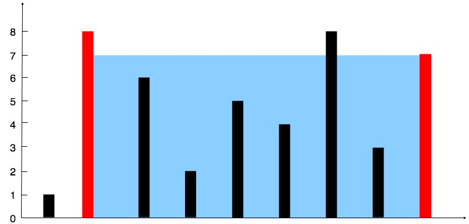

Дано целое число height длины n. Проведено n вертикальных линий так, что две конечные точки i-й линии - (i, 0) и (i, height[i]).

Найдите две прямые, которые вместе с осью x образуют контейнер, содержащий наибольшее количество воды.

Верните максимальное количество воды, которое может вместить контейнер.

Обратите внимание, что контейнер нельзя наклонять.

Пример 1:

Вход: height = [1,8,6,2,5,4,8,3,7].
Выходные данные: 49
Пояснения: Вертикальные линии представлены массивом [1,8,6,2,5,4,8,3,7]. В данном случае максимальная площадь воды (синяя часть), которую может вместить контейнер, равна 49.